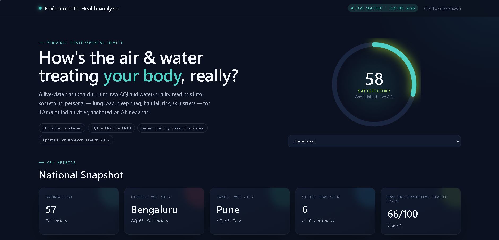
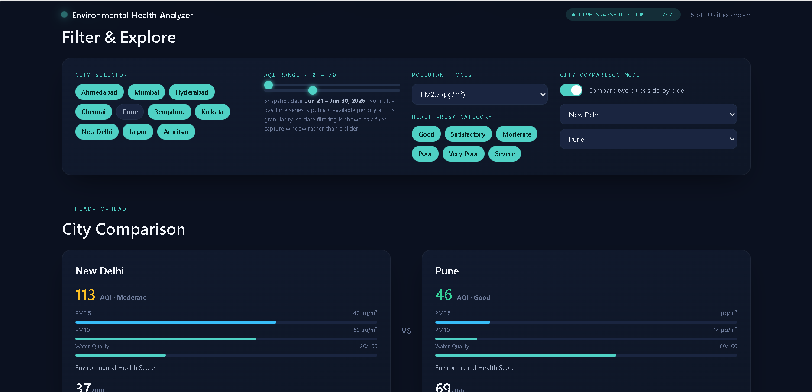
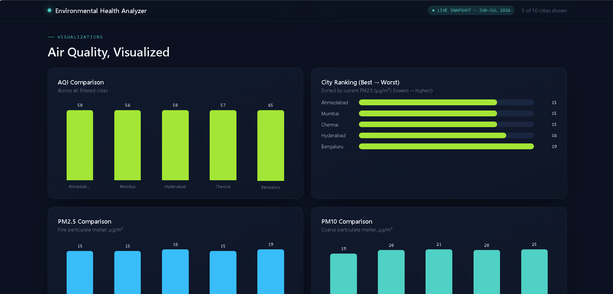
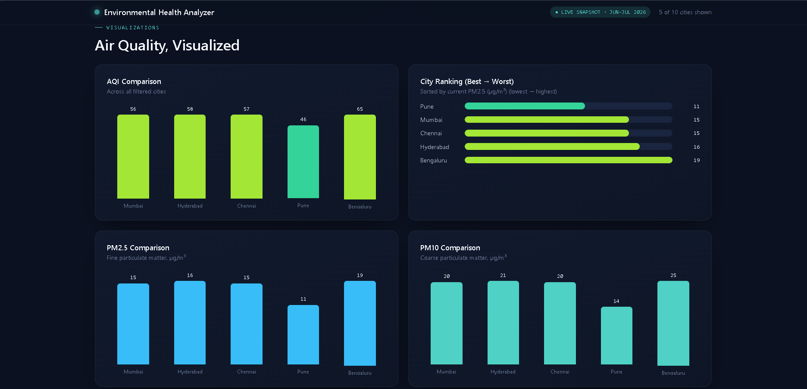
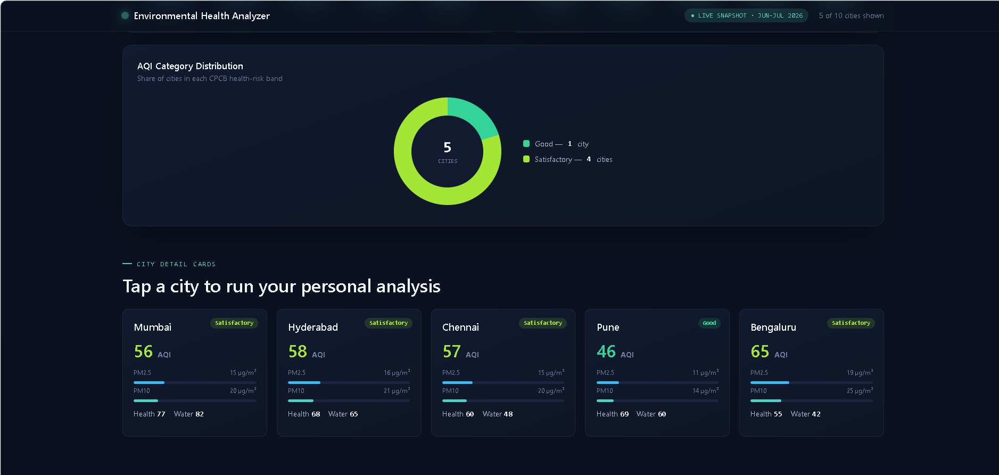
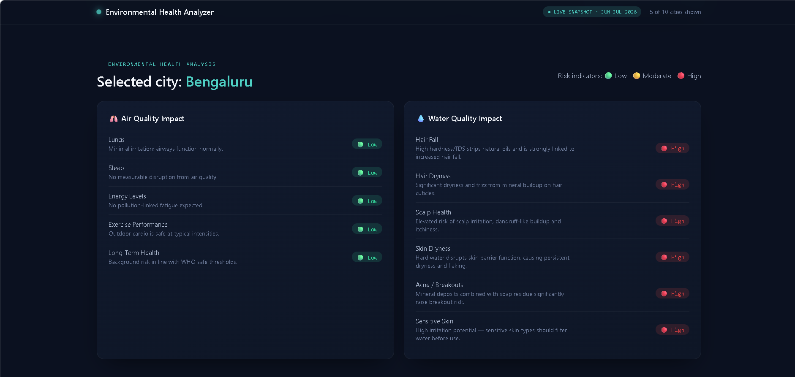
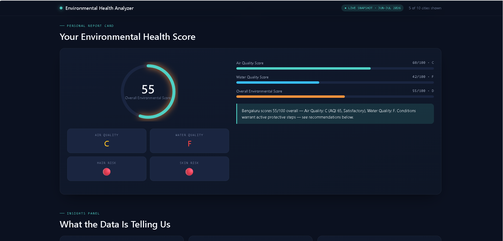
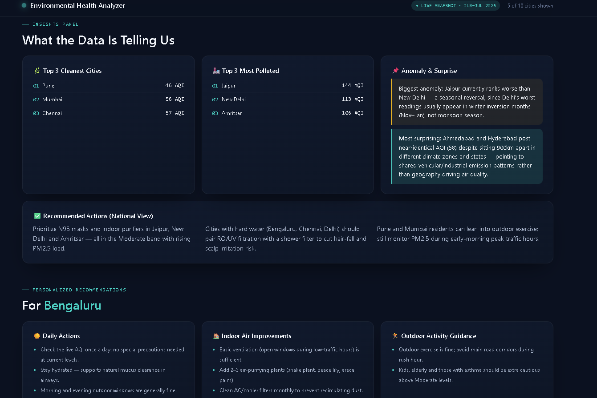
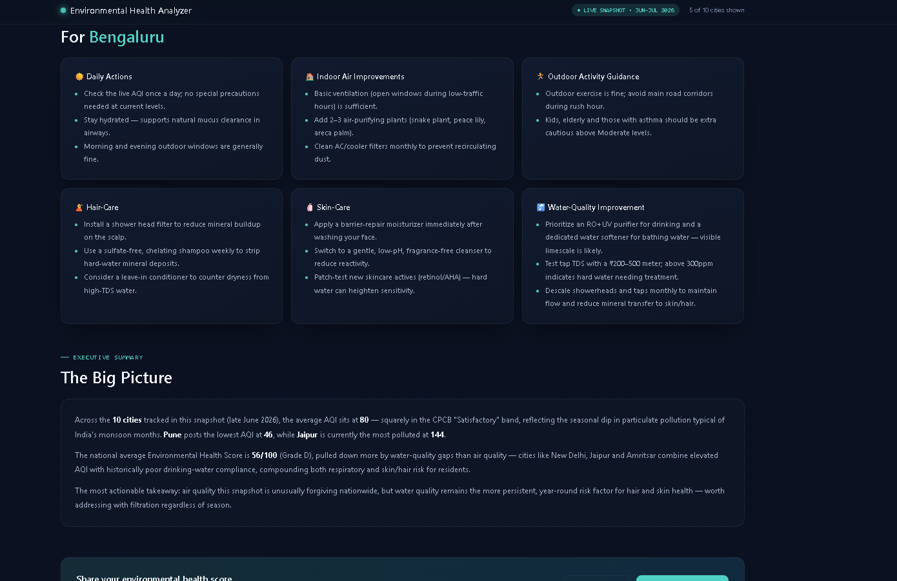
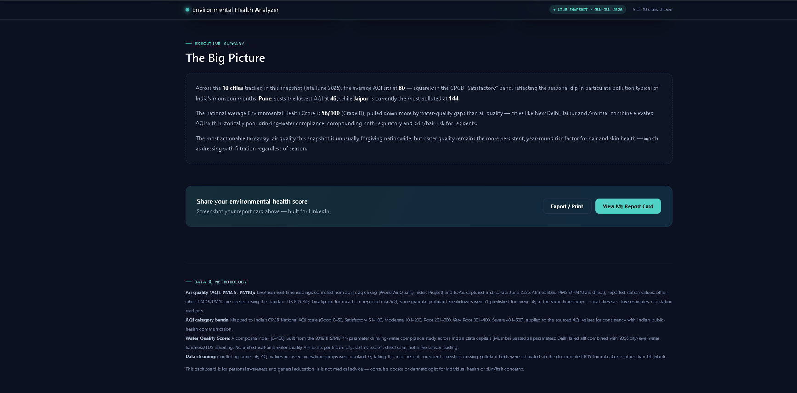

# 🌍 Day 8 – Personal Environmental Health Analyzer

## Overview

This project demonstrates how Claude Artifacts can generate a complete interactive environmental health dashboard using air quality (AQI) and water quality data.

The generated application is fully responsive and includes interactive filters, city comparison, environmental health analysis, report cards, visualizations, and personalized recommendations.

---

# Project Files

- **Generated HTML Application:** `index.html`
- **Documentation:** `day8.md`
- **Dashboard Screenshots:** `dashboard1.png` to `dashboard10.png`

---

# Features

- Interactive Environmental Health Dashboard
- AQI Comparison
- PM2.5 Comparison
- PM10 Comparison
- City Ranking
- AQI Distribution
- Environmental Health Score
- Air Quality Analysis
- Water Quality Analysis
- Personalized Recommendations
- Interactive Filters
- City Comparison Mode
- Responsive Dark Theme UI

---

# Dashboard Screenshots

## Dashboard Overview

---

# Generated HTML Application

The complete interactive application is included in this folder as:

**`index.html`**

The HTML file contains:

- Responsive dashboard
- Interactive controls
- AQI visualizations
- PM2.5 & PM10 charts
- City comparison
- Environmental Health Report Card
- Personalized recommendations
- Responsive layout

---

# Key Insights

- Air quality differs significantly across major cities.
- PM2.5 has the highest impact on respiratory health.
- Water quality also affects skin and hair health.
- Environmental Health Scores make it easier to compare cities.
- Interactive dashboards improve understanding of environmental data.

---

# Key Learnings

- Learned how Claude Artifacts can generate complete web applications.
- Explored AI-assisted dashboard development.
- Understood how environmental datasets can be transformed into interactive visualizations.
- Learned how HTML applications can be generated without manual frontend development.
- Improved understanding of AQI, PM2.5, PM10, and environmental health metrics.
- Gained experience documenting AI-generated projects for GitHub.

---

# Conclusion

This project demonstrates how Claude can be used to build complete interactive HTML applications with data visualization, user interaction, and modern dashboard design using a single well-structured prompt.
