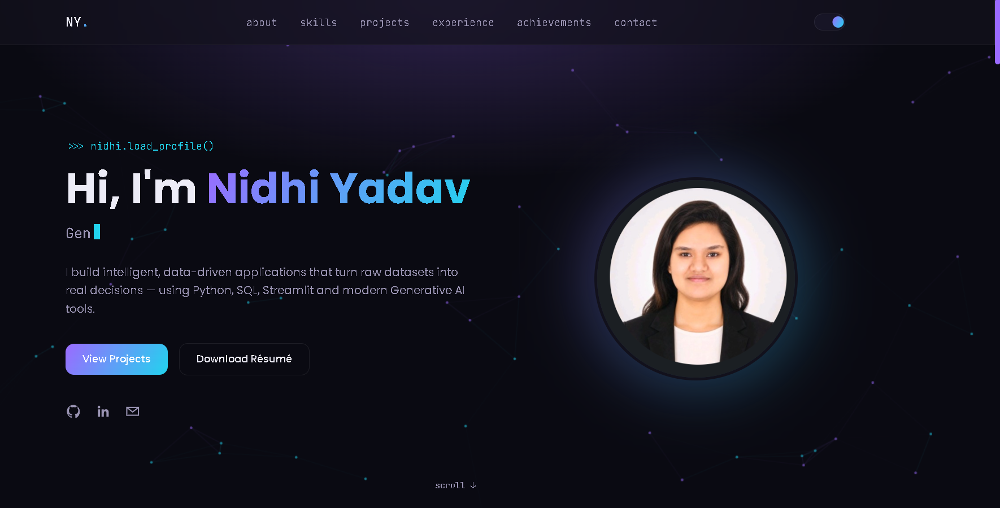
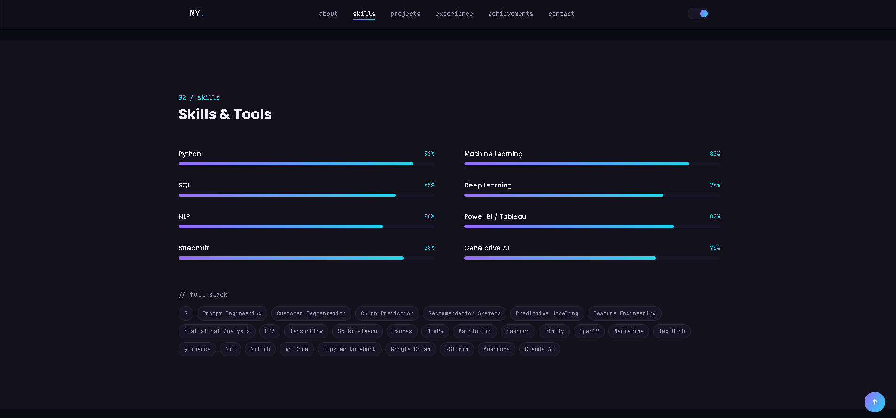
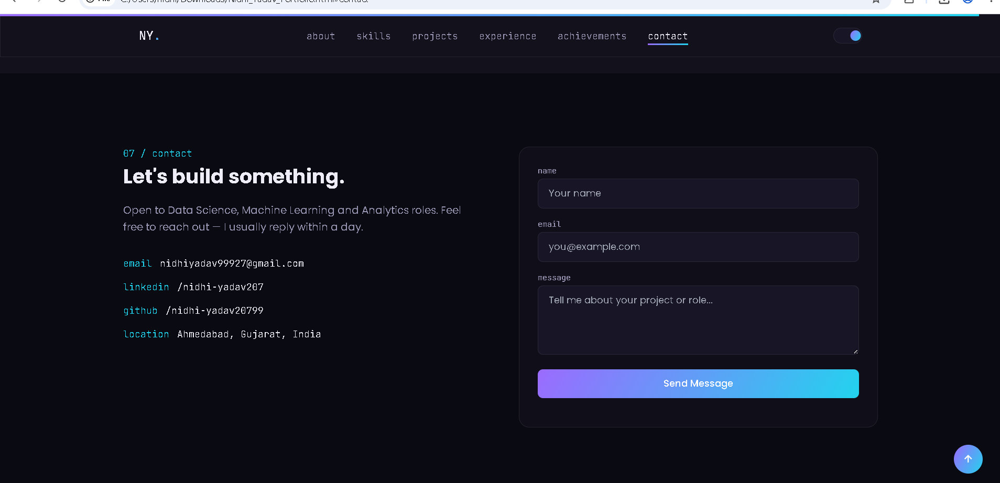

# Day 10 – Personal Portfolio Website

## Objective

Built a modern personal portfolio website using Claude Artifacts.

## Technologies Used

- HTML5
- Tailwind CSS (CDN)
- Vanilla JavaScript
- Claude AI
- Responsive Web Design

## Features

- Responsive Portfolio Website
- Dark / Light Mode
- Animated Hero Section
- Typing Animation
- About Me
- Skills Section
- Experience Timeline
- Project Showcase
- Achievements & Certifications
- Contact Form
- Smooth Scroll Animations
- Mobile Responsive Design
- SEO Meta Tags

## Projects Included

- InsightEngine – Customer Analytics Platform
- ChurnShield – Customer Churn Prediction Dashboard
- Retail Insights – E-Commerce Sales Analysis
- Real-Time Indian Sign Language Recognition
- Fake News Detection using NLP

## What I Learned

- Building a professional portfolio with Claude Artifacts
- Creating responsive websites using Tailwind CSS
- Structuring recruiter-friendly portfolio content
- Improving UI/UX with animations and modern layouts
- Organizing projects for better personal branding

## Screenshots

### Home

### Skills

### Projects

### Contact

## Files

- Nidhi_Yadav_Portfolio.html

## Future Improvements

- Deploy on Vercel
- Add custom domain
- Improve animations using GSAP
- Add interactive particle background
- Fix GitHub statistics widget
- Add live project demos
