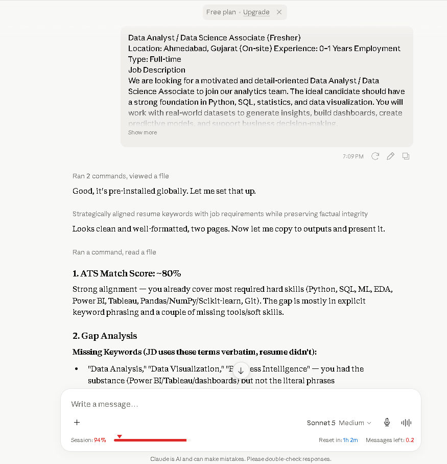
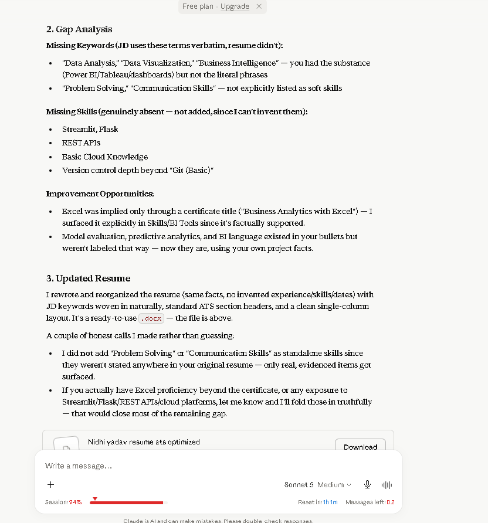
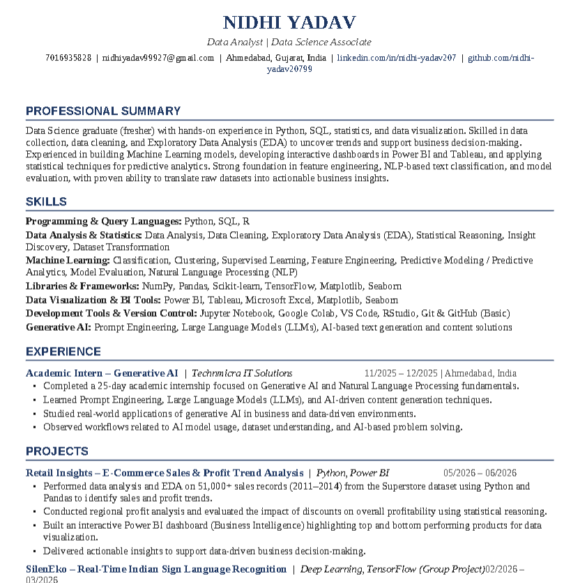
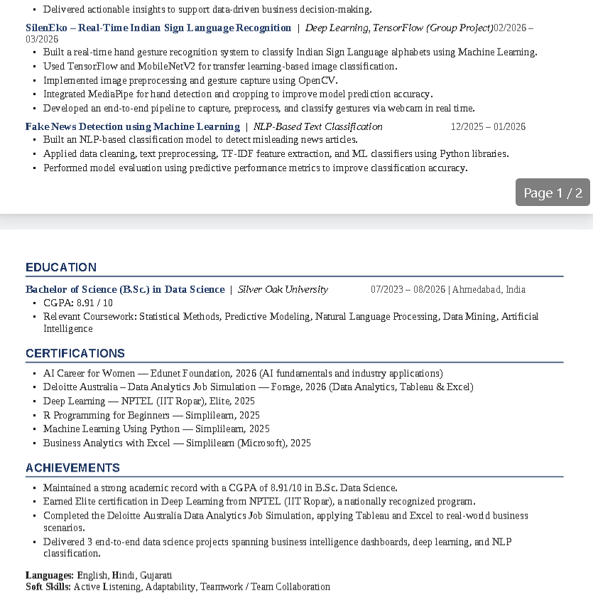

# Day 11 – ATS Resume Optimizer & Resume Generator

## Objective

Learned how Applicant Tracking Systems (ATS) evaluate resumes and optimize resumes for better recruiter visibility using Claude AI.

---

# ATS Analysis

## ATS Match Score & Gap Analysis

---

# Optimized Resume

## Page 1

## Page 2

---

# Resume File

📄 **Nidhi_Yadav_Resume_ATS_Optimized.docx**

---

# Key Learnings

- Learned how ATS systems scan resumes before recruiters review them.
- Improved keyword alignment based on the target job description.
- Optimized resume formatting for ATS compatibility.
- Understood the importance of relevant skills and recruiter-friendly resume structure.
- Learned to enhance a resume without adding false information.

---

# Tools Used

- Claude AI
- Microsoft Word
- GitHub

---

# Deliverables

-  ATS Analysis
-  Gap Analysis
-  Optimized Resume
-  Resume Screenshots
-  Resume Document
