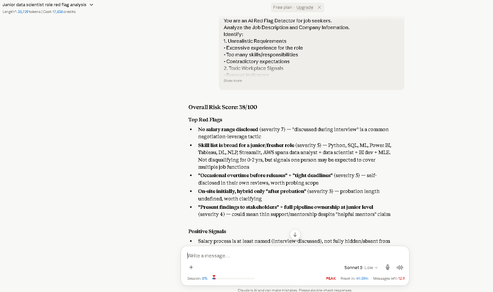
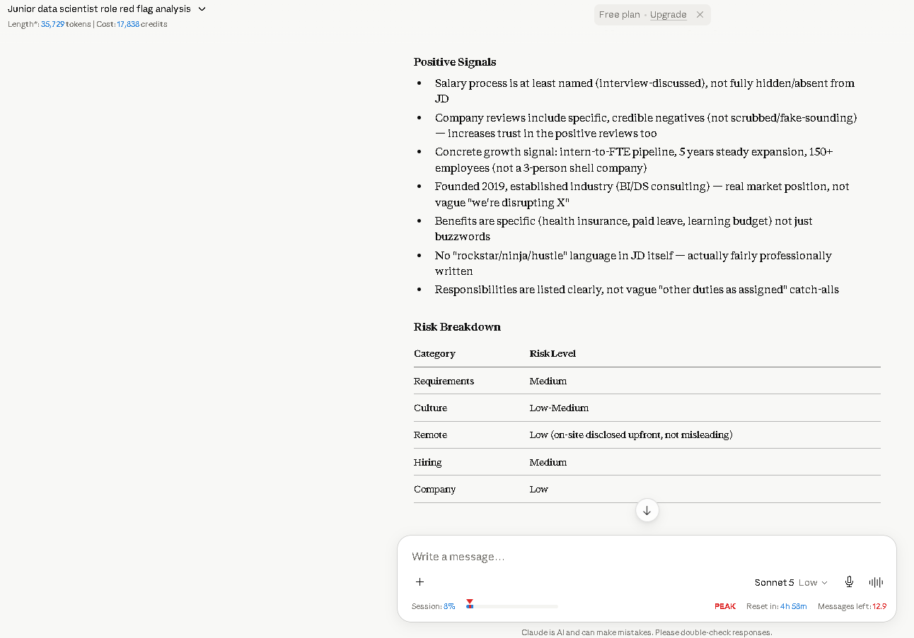
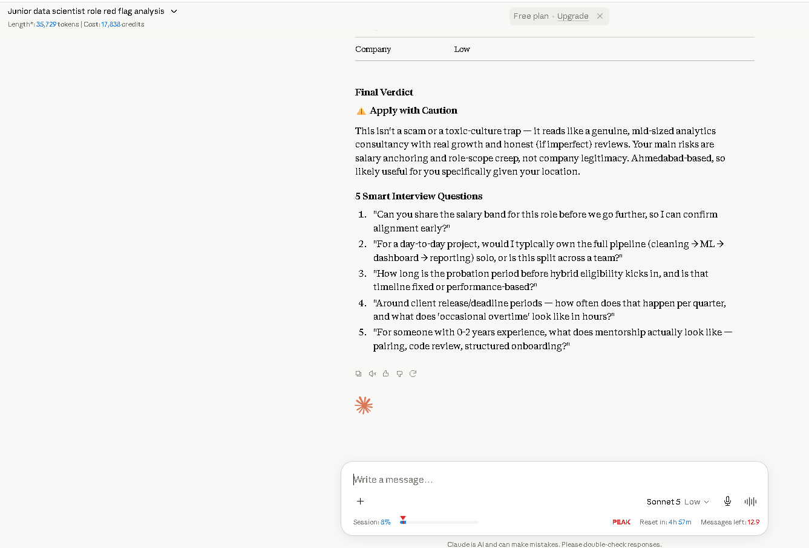

# Day 14 – AI Job Red Flag Detector

## Overview

Today's task focused on evaluating a job opportunity using Claude AI. Instead of only checking whether a role matches my technical skills, I analyzed the company, hiring process, work culture, and potential risks before applying.

---

## Job Information

**Role:** Junior Data Scientist

**Location:** Ahmedabad, Gujarat (On-site)

**Experience:** 0–2 Years

**Employment Type:** Full-Time

---

## Company Summary

**Company:** DataNova Analytics Pvt. Ltd.

**Industry:** Data Analytics & Artificial Intelligence

**Founded:** 2019

**Company Size:** 150+ Employees

**Work Model:** Hybrid after probation

---

# Risk Analysis Report

## Overall Risk Score

**38 / 100**

A relatively low-risk opportunity with a few areas that should be clarified during the interview process.

---

## Top Red Flags

| Red Flag | Severity |
|----------|----------|
| Salary range not disclosed | 7 / 10 |
| Broad skill requirements for a junior role | 5 / 10 |
| Tight deadlines and occasional overtime | 5 / 10 |
| Hybrid work only after probation | 3 / 10 |
| Junior employee expected to present to stakeholders | 4 / 10 |

---

## Positive Signals

- Clearly defined responsibilities
- Learning budget and employee benefits
- Health insurance and paid leave
- Intern-to-full-time hiring pipeline
- Steady company growth
- Realistic employee reviews with both positives and negatives
- No unrealistic "rockstar" or hustle culture language

---

## Risk Breakdown

| Category | Risk Level |
|-----------|------------|
| Requirements | Medium |
| Culture | Low-Medium |
| Remote Policy | Low |
| Hiring Process | Medium |
| Company Stability | Low |

---

## Final Verdict

**⚠️ Apply with Caution**

The company appears to be a legitimate and growing analytics organization. The primary concerns are the lack of salary transparency and the broad range of responsibilities expected from a junior employee. Overall, it seems like a worthwhile opportunity, but important details should be clarified during the interview.

---

## Suggested Interview Questions

1. Can you share the salary range for this position before moving forward?
2. Will junior employees manage the complete data pipeline independently or work as part of a team?
3. How long is the probation period before hybrid work becomes available?
4. How frequently does overtime occur during project delivery?
5. What mentoring or onboarding support is provided for fresh graduates?

---

## Key Learnings

- A job description should be evaluated from the candidate's perspective as well.
- Missing salary information is an important point to clarify early.
- Company culture can often be inferred from the language used in the job description.
- Employee reviews provide useful insights into work-life balance.
- AI tools can help identify potential risks before investing time in an interview.

---

## Screenshots

## Screenshots

### Report Output

