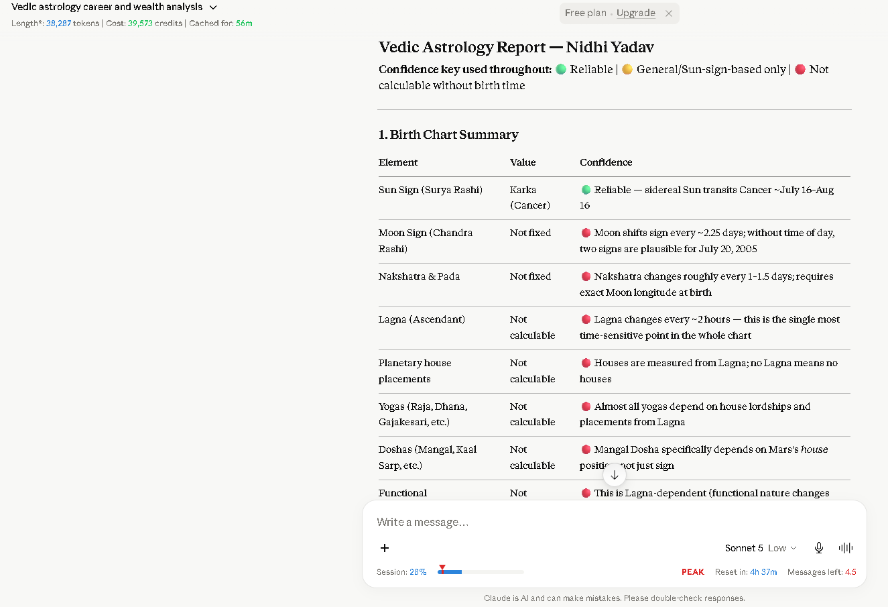
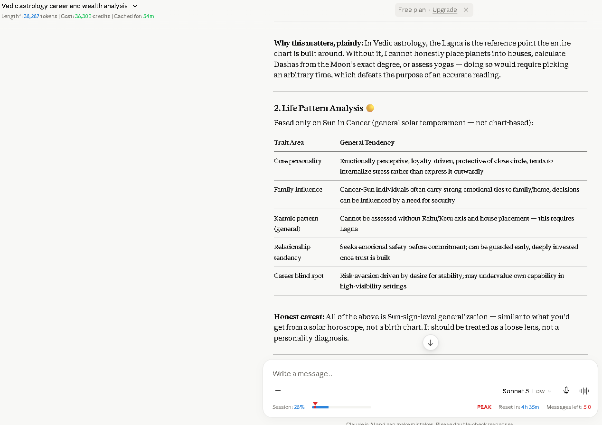
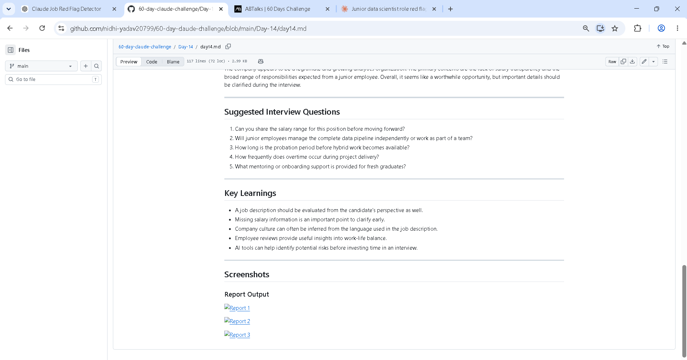
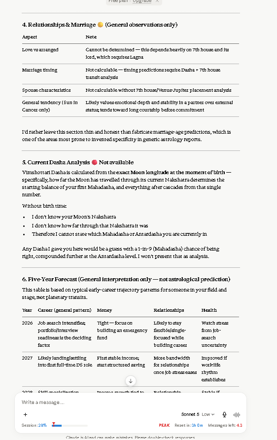
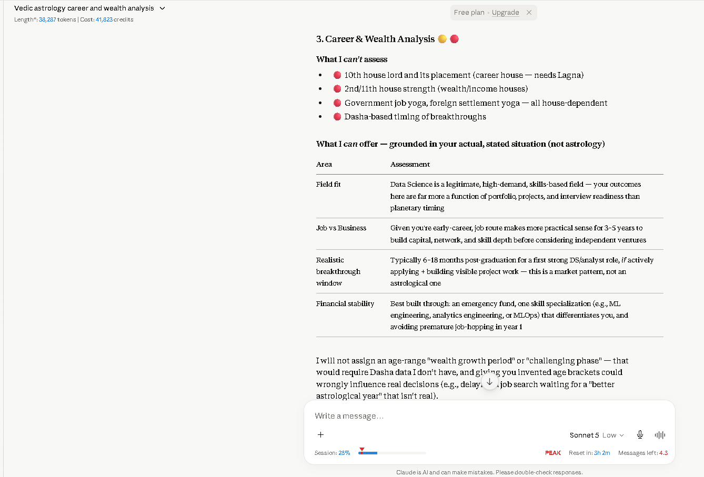
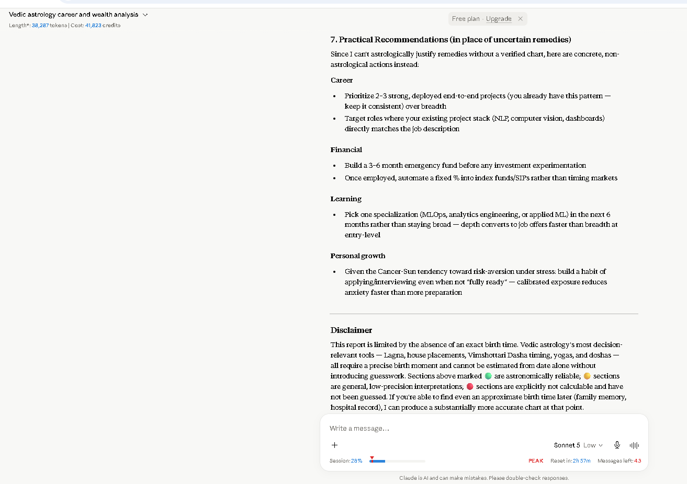

# Day 15 – AI Astrology & Life Analysis

## Overview

Today's task focused on creating a structured life analysis report using Claude AI. The objective was to explore how detailed prompts and organized inputs help generate comprehensive reports while handling uncertainty responsibly.

> **Note:** This report was generated for learning Prompt Engineering as part of the **60 Day Claude Challenge**. It is not professional astrological advice.

---

## Input Details

For privacy reasons, personally identifiable information such as name, date of birth, and place of birth has been omitted from this public repository.

The report was generated using:
- Gender
- Unknown birth time
- Current profession
- Career-related concerns

---

# Report Summary

Claude generated a structured report covering:

- Birth Chart Summary
- Life Pattern Analysis
- Career & Wealth Analysis
- Relationships & Marriage
- Current Dasha Analysis
- Five-Year Forecast
- Practical Recommendations

Since the birth time was unavailable, Claude clearly identified which parts could not be calculated instead of making unsupported assumptions.

---

# Key Findings

## Birth Chart Summary

- Sun Sign: Cancer (Reliable)
- Moon Sign: Not Determinable
- Ascendant (Lagna): Not Available
- Nakshatra: Not Available
- Yogas & Doshas: Cannot be calculated without birth time

---

## Career & Wealth

The report emphasized practical career planning over speculative predictions.

Highlights:

- Continue building strong Data Science projects.
- Focus on gaining industry experience before considering business opportunities.
- Strengthen technical skills and maintain a consistent learning path.
- Build financial stability through disciplined saving and long-term planning.

---

## Relationships

The report avoided making unsupported predictions because accurate relationship analysis requires an exact birth time.

---

## Current Dasha

Claude explained that Vimshottari Dasha cannot be calculated without precise birth details and therefore did not generate misleading information.

---

## Five-Year Outlook

Instead of presenting uncertain astrological predictions, the report provided a practical career-focused outlook based on professional growth, skill development, and financial planning.

---

# Key Learnings

- Structured prompts produce more organized AI responses.
- High-quality outputs depend on complete and accurate inputs.
- AI should acknowledge uncertainty instead of generating inaccurate information.
- Transparency improves the reliability of AI-generated reports.
- Prompt engineering is as much about defining limitations as generating answers.

---

# Reflection

One of the most valuable observations from this exercise was seeing Claude distinguish between information it could confidently determine and information that required additional data. Rather than inventing missing details, it explained the limitations clearly and shifted the focus toward practical, actionable guidance.

---

# Screenshots

## Claude Output

