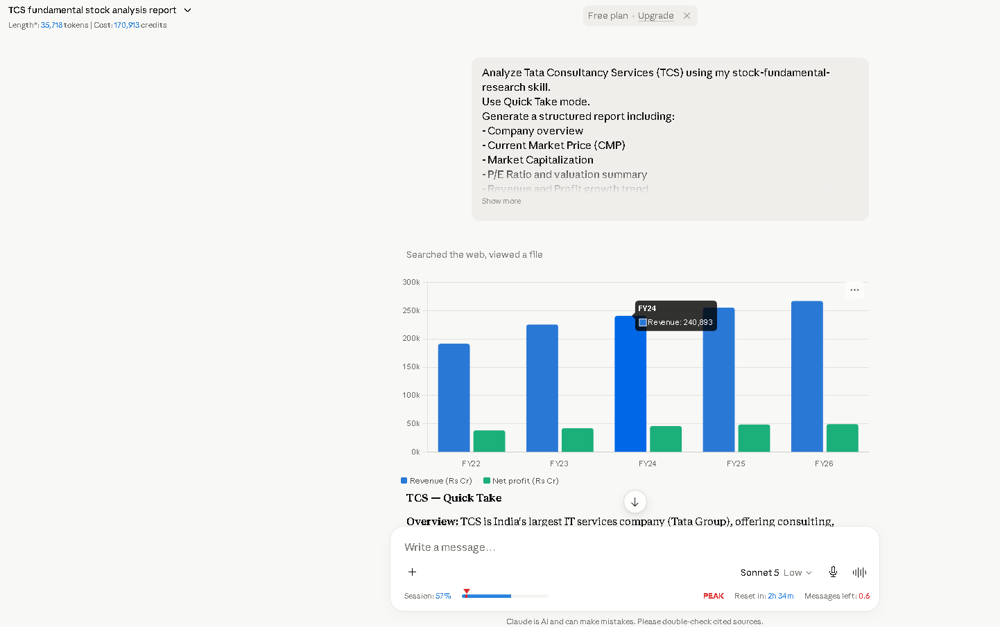
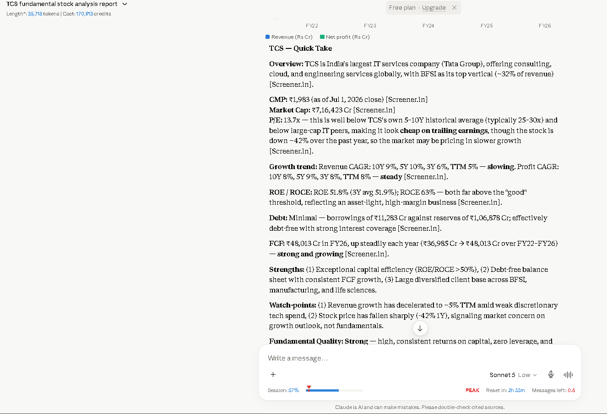
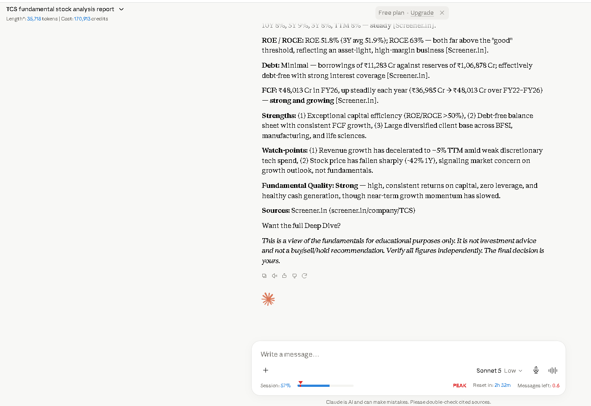

# Day 16 – Building a Reusable Stock Research Skill

## Overview

Today's task focused on creating a reusable Custom Skill in Claude for fundamental stock analysis. Instead of repeatedly entering long prompts, I built a reusable workflow that generates structured research reports with consistent formatting and evidence-based insights.

To test the skill, I analyzed **Tata Consultancy Services (TCS)** using the Quick Take mode.

---

# Objective

- Create a reusable Custom Skill in Claude.
- Build a standardized workflow for stock research.
- Generate structured financial reports.
- Reduce repetitive prompting through reusable AI workflows.

---

# Custom Skill

## Skill Name

**stock-fundamental-research**

## Description

A reusable AI workflow designed to analyze Indian and global listed companies using fundamental analysis, financial statements, valuation metrics, business quality, competitive advantages, financial health, risks, and growth trends while avoiding investment recommendations.

---

# Test Company

**Company:** Tata Consultancy Services (TCS)

**Analysis Mode:** Quick Take

---

# Report Summary

The generated report included:

- Company Overview
- Current Market Price (CMP)
- Market Capitalization
- P/E Ratio & Valuation Summary
- Revenue & Profit Growth Trend
- ROE & ROCE
- Debt Position
- Free Cash Flow Overview
- Business Strengths
- Risk Factors
- Fundamental Quality Assessment
- Source References
- Educational Disclaimer

---

# Key Insights

## Business Overview

TCS continues to be one of India's largest IT services companies with a diversified global customer base and strong presence across multiple industries.

## Financial Highlights

- Strong Return on Equity (ROE)
- High Return on Capital Employed (ROCE)
- Healthy Free Cash Flow generation
- Very low debt position

## Growth

The report highlighted that revenue growth has moderated compared to previous years, while profitability remains relatively stable.

## Risks

Some important observations included:

- Slower revenue growth compared to historical trends.
- Market concerns reflected in recent stock price performance.

---

# What I Learned

- Custom Skills eliminate repetitive prompting by saving reusable workflows.
- Well-structured prompts produce consistent and organized outputs.
- AI can summarize complex financial information into an easy-to-read format.
- Standardized workflows improve productivity and save time.
- Source-backed analysis increases transparency and reliability.

---

# Reflection

Creating a reusable Custom Skill demonstrated how AI workflows can become significantly more efficient. Instead of rewriting the same prompt for every company, the saved skill produced structured and consistent reports with minimal effort. This exercise highlighted the practical value of prompt engineering for repetitive analytical tasks.

---

# Disclaimer

This exercise was completed as part of the **60 Day Claude Challenge** to learn prompt engineering and reusable AI workflows. The generated stock analysis is intended for educational purposes only and should not be considered financial or investment advice.

---

# Screenshots

## Custom Skill

## Generated Stock Analysis

