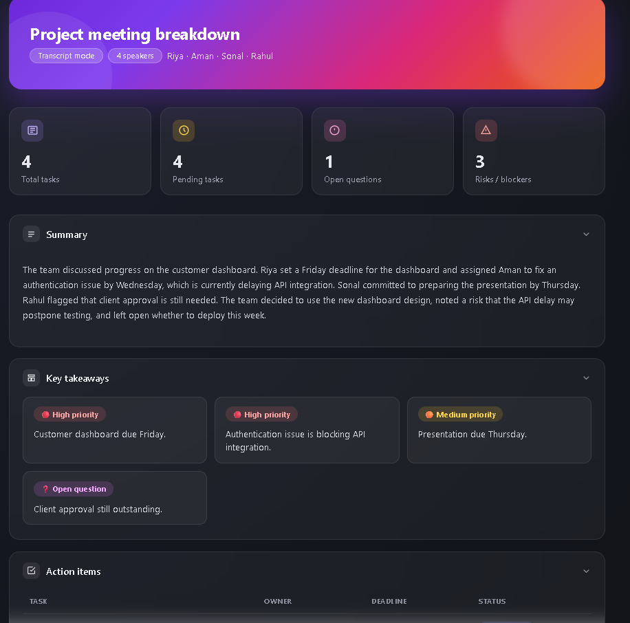
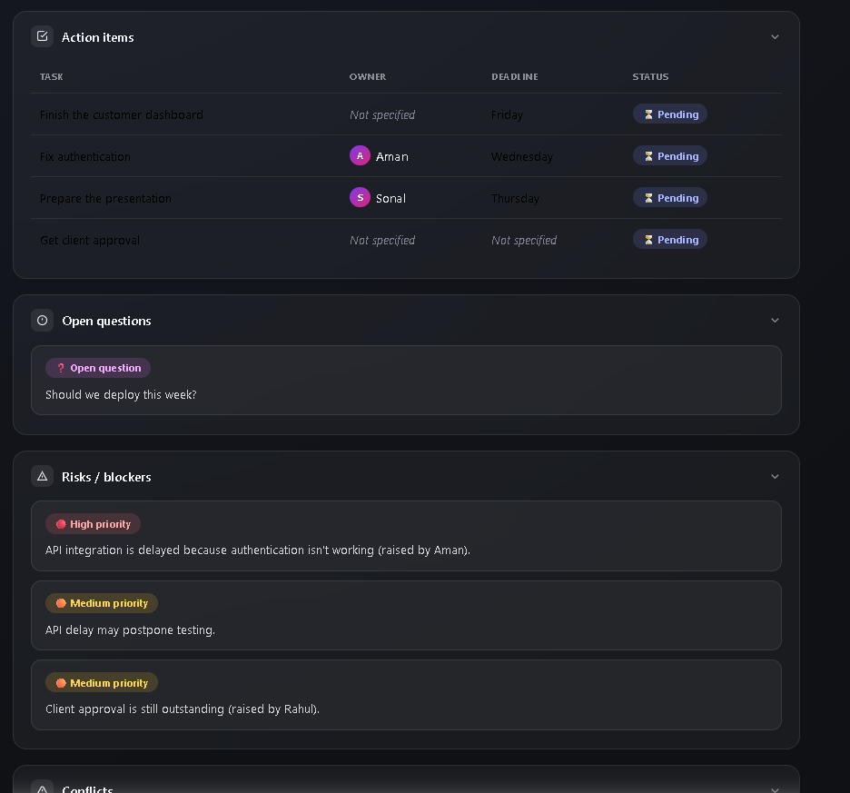
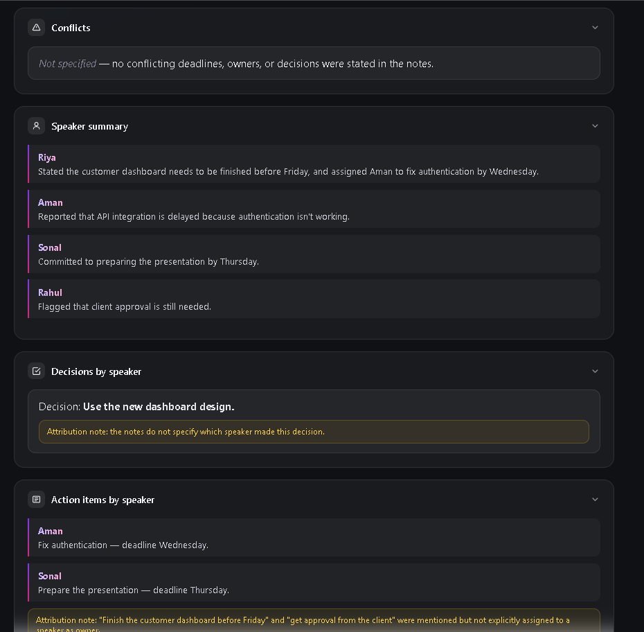
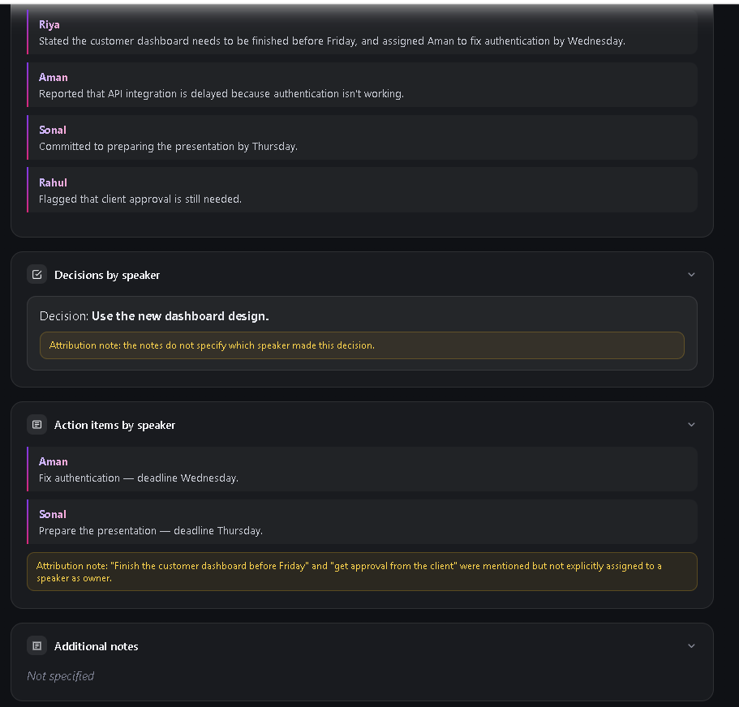

# Day 18 – Brain Dump Action Planner

## Overview

Today I created a reusable Claude Custom Skill called **Brain Dump Action Planner** that converts unstructured notes, meeting transcripts, brainstorming sessions, and voice memos into a structured project dashboard.

The skill automatically organizes information into summaries, action items, decisions, risks, blockers, conflicts, and open questions while preserving all original information without making assumptions.

---

## Objective

- Build a reusable Claude Custom Skill.
- Convert messy meeting notes into a structured dashboard.
- Generate an interactive HTML artifact.
- Improve project organization and productivity.

---

## Custom Skill

**Skill Name:** Brain Dump Action Planner

### Description

Transforms messy notes, meeting transcripts, brainstorming sessions, and voice memos into structured summaries, action plans, decisions, open questions, risks, blockers, and task lists while preserving all original information.

---

## Features

- Interactive HTML Dashboard
- Meeting Summary
- Key Takeaways
- Action Items Table
- Open Questions
- Risks & Blockers
- Conflict Detection
- Speaker Summary
- Decisions by Speaker
- Action Items by Speaker
- Responsive Design
- Modern Dashboard UI
- Reusable Custom Skill

---

## Files Included

```
Day-18/
│
├── dashboard.html
├── day18.md
├── 03_dashboard_overview.png
├── 05_action_items_and_risks.png
├── 08_speaker_summary_and_decisions.png
└── 09_additional_notes.png
```

---

## Dashboard Preview

### Dashboard Overview



---

### Action Items & Risks



---

### Speaker Summary & Decisions



---

### Additional Notes



---

## Key Learnings

- Learned how to build reusable Claude Custom Skills.
- Converted unstructured meeting notes into structured dashboards.
- Created a responsive HTML dashboard with modern UI.
- Organized action items, decisions, blockers, and open questions automatically.
- Improved productivity using reusable AI workflows.

---

## Conclusion

The Brain Dump Action Planner demonstrates how Claude Custom Skills can automate note organization and project planning. Instead of manually restructuring meeting notes, the skill generates a professional dashboard that is reusable across different projects and workflows.
