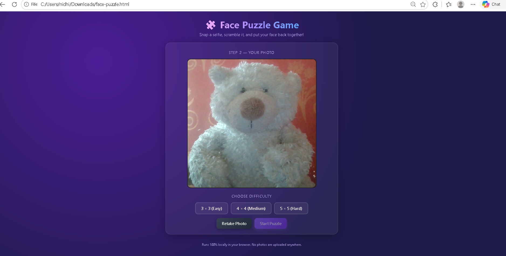
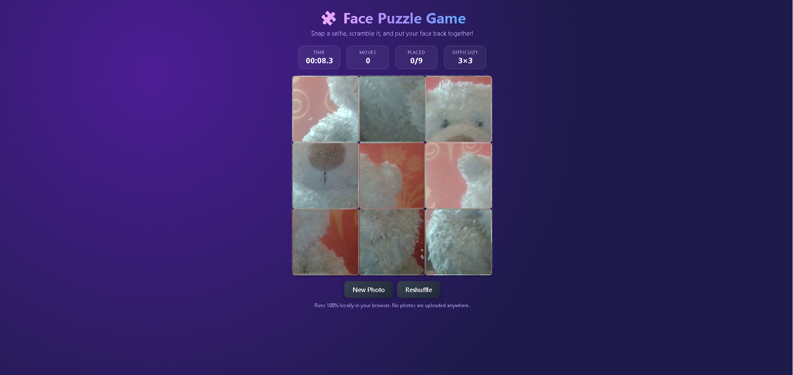
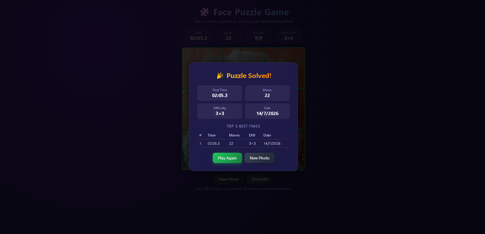

# 🧩 Day 20 – AI Face Puzzle Game

## Project Overview

For today's challenge, I built an AI Face Puzzle Game using HTML, CSS, and Vanilla JavaScript. The application captures an image through the browser camera, converts it into a puzzle, tracks gameplay statistics, and stores the best scores using Local Storage.

---

## Screenshots

### Captured Image and Difficulty Selection

### Puzzle Gameplay

### Puzzle Solved

---

## Features

- Webcam image capture
- Puzzle generation from the captured image
- Three difficulty levels (3×3, 4×4, and 5×5)
- Drag-and-drop puzzle interaction
- Touch support for mobile devices
- Live timer
- Move counter
- Correct piece tracker
- Automatic puzzle completion detection
- Local leaderboard
- Retake photo option
- Reshuffle puzzle option
- Play Again button
- Responsive interface

---

## Technologies Used

- HTML5
- CSS3
- Vanilla JavaScript
- MediaDevices API
- Canvas API
- Local Storage

---

## What I Learned

- Accessing the webcam using the MediaDevices API.
- Capturing images with the Canvas API.
- Splitting an image into multiple puzzle pieces.
- Implementing drag-and-drop interactions.
- Tracking time and move count during gameplay.
- Detecting puzzle completion.
- Saving and retrieving leaderboard data using Local Storage.
- Building a responsive browser game without using frameworks.

---

## Outcome

The application successfully captures an image, generates a playable puzzle, tracks user performance, and stores the best results locally. This project helped strengthen my understanding of browser APIs, image processing, and interactive web application development.

---

## Files Included

- face-puzzle.html
- day20.md
- Face.png
- Face_puzzle_game.png
- Solved_face_puzzle.png
