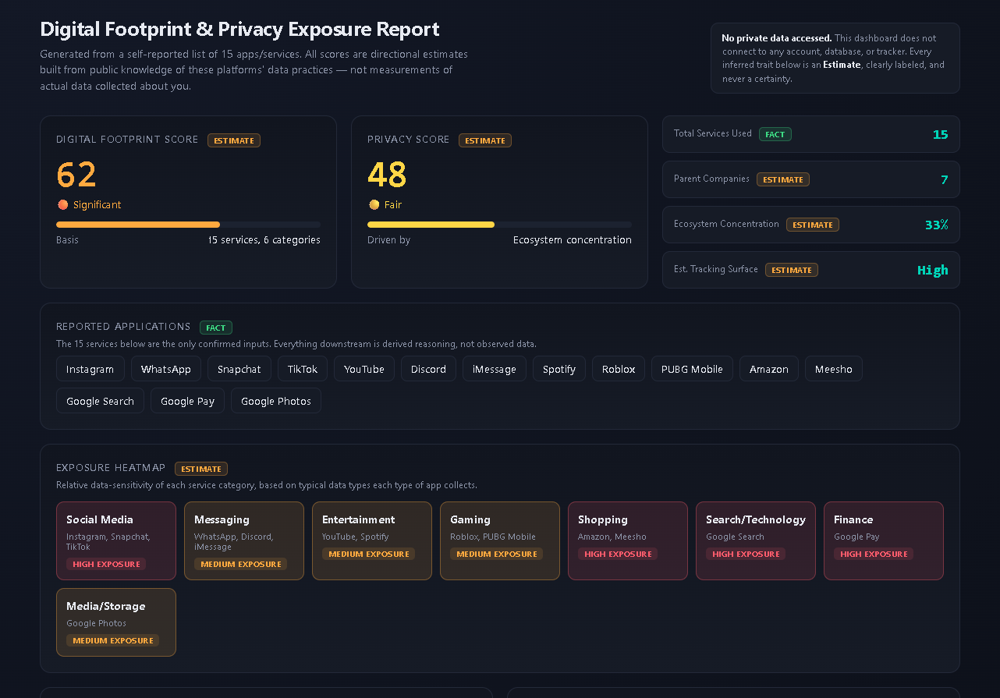
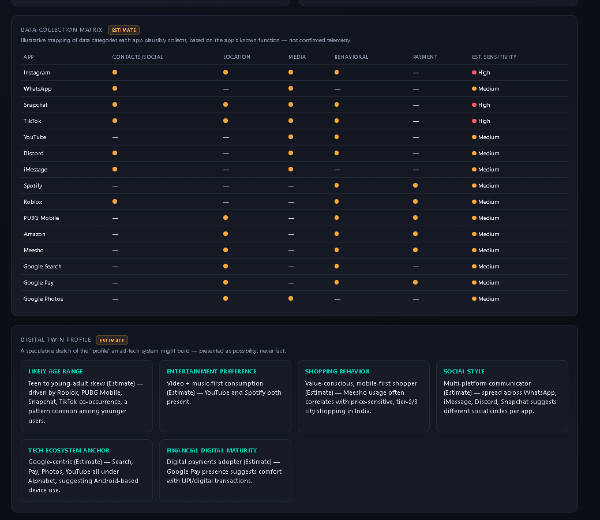
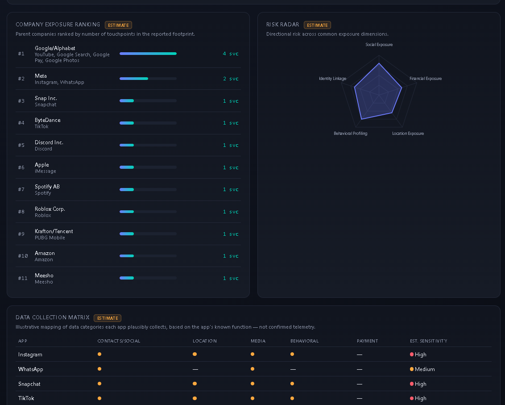
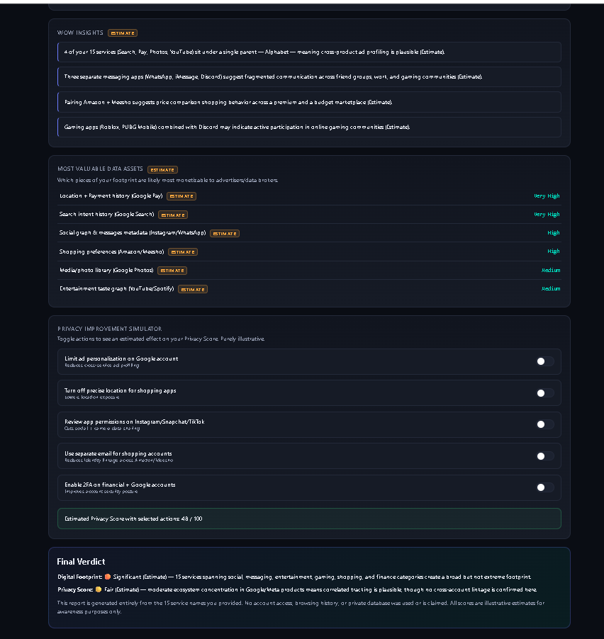

# Day 21 – Digital Privacy Intelligence Dashboard

## Project Overview

For today's challenge, I built a Digital Privacy Intelligence Dashboard that analyzes a sample digital footprint and presents privacy-related insights through an interactive web interface. The dashboard visualizes privacy exposure, estimated tracking risks, ecosystem concentration, and actionable recommendations for improving online privacy.

---

## Screenshots

### Dashboard Overview

### Data Collection Matrix

### Risk Radar

### Privacy Report

---

## Features

- Digital Footprint Score
- Privacy Score
- Exposure Heatmap
- Company Exposure Ranking
- Data Collection Matrix
- Risk Radar
- Digital Twin Profile
- Most Valuable Data Assets
- Privacy Improvement Plan
- Interactive Dashboard
- Responsive Design
- Modern Analytics Interface

---

## Technologies Used

- HTML5
- CSS3
- Vanilla JavaScript
- SVG Charts
- Local Browser Rendering

---

## Privacy Insights

- Multiple online services contribute to an increased digital footprint.
- Parent company concentration increases potential data aggregation.
- Communication, shopping, and search services represent the largest estimated tracking surface.
- Privacy can be improved by limiting permissions, reducing account sharing, and reviewing privacy settings regularly.

---

## What I Learned

- How digital services contribute to online privacy exposure.
- The importance of ecosystem concentration in data collection.
- How privacy dashboards can visualize complex information.
- Presenting privacy insights while clearly separating facts from estimates.
- Building interactive dashboards using only HTML, CSS, and JavaScript.

---

## Outcome

This project demonstrates how web technologies can be used to create an interactive privacy intelligence dashboard that summarizes digital footprint, estimates privacy exposure, and provides practical recommendations for improving online privacy awareness.

---

## Files Included

- digital_footprint_dashboard.html
- day21.md
- digital_footprint_Dashboard.png
- Data_collection.png
- Risk_Radar.png
- Privacy_Report.png
