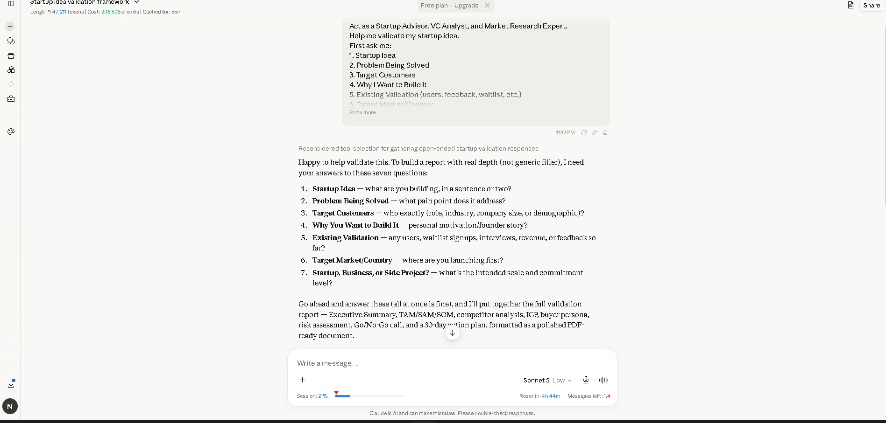
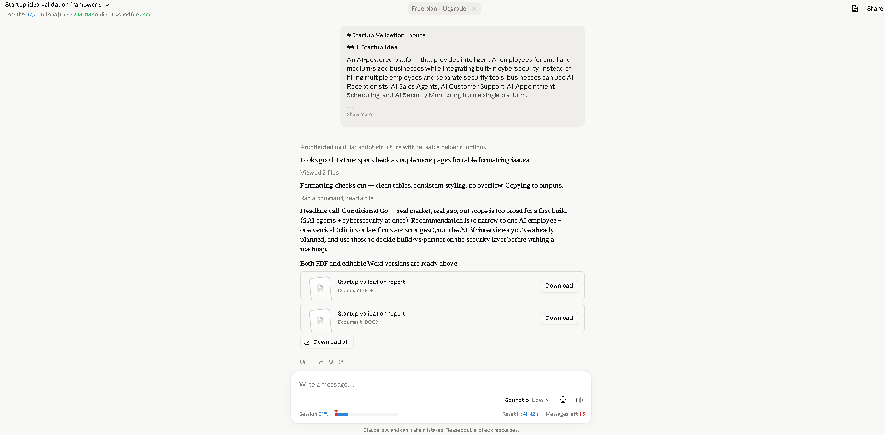
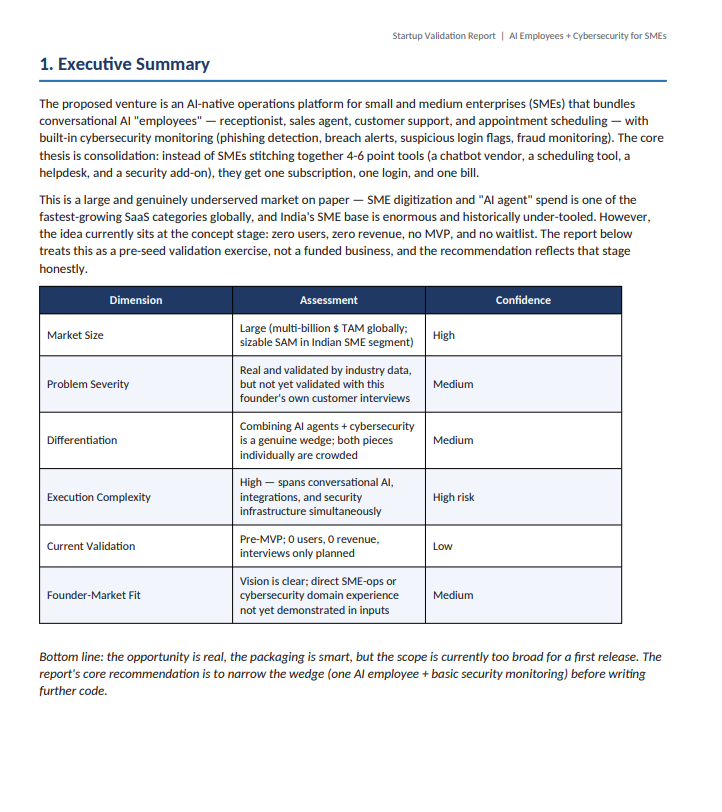
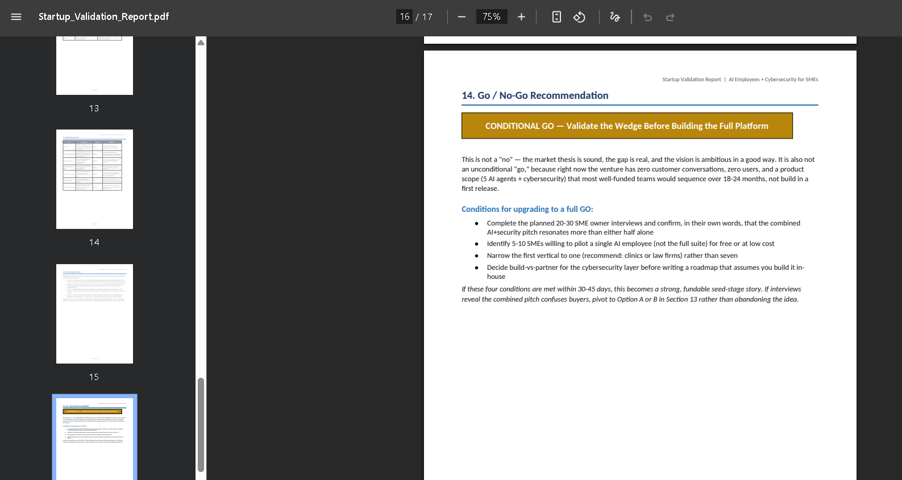
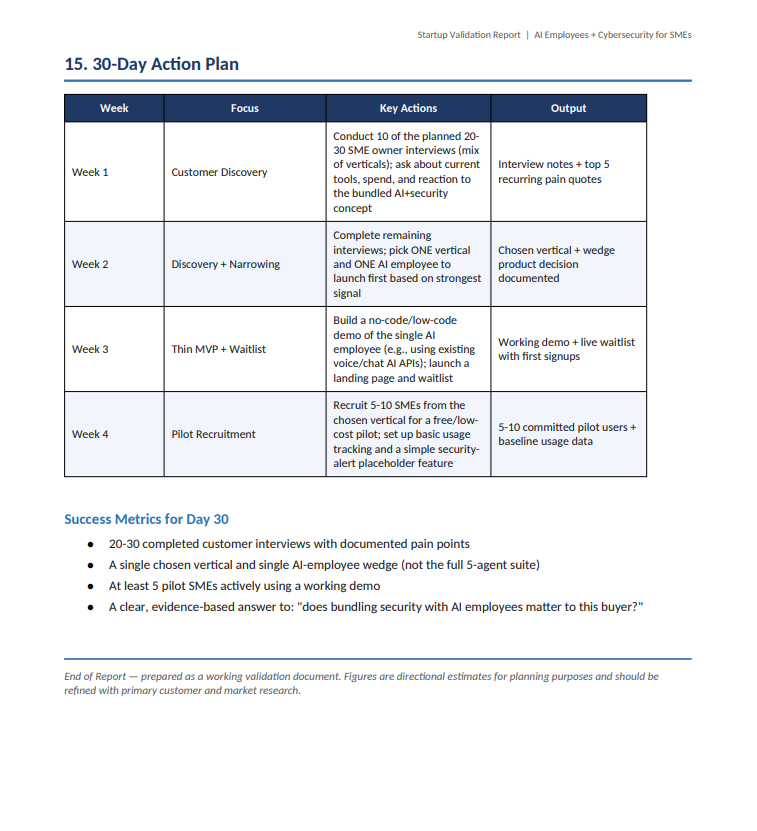

# Day 22 – Startup Idea Validation Framework

## Overview

On Day 22 of the 60 Day Claude Challenge, I used Claude AI as a **Startup Advisor, VC Analyst, and Market Research Expert** to validate a startup idea before investing time into development.

The startup idea focuses on building an **AI Workforce Operating System** that combines intelligent AI employees with built-in cybersecurity for Small and Medium Businesses (SMEs).

---

# Startup Idea

**AI Workforce OS**

An AI-powered SaaS platform that provides virtual AI employees while protecting businesses with integrated cybersecurity.

### AI Employees

- AI Receptionist
- AI Sales Agent
- AI Customer Support
- AI Appointment Scheduler
- AI Administrative Assistant

### Cybersecurity Features

- Phishing Detection
- Suspicious Login Monitoring
- Fraud Detection
- Data Leak Alerts
- Security Monitoring Dashboard

---

# Problem Statement

Small businesses often face:

- Limited hiring budgets
- Staff shortages
- Slow customer response times
- Expensive cybersecurity solutions
- Multiple disconnected software tools

The platform aims to solve these problems by combining AI automation and cybersecurity into one affordable solution.

---

# Target Customers

- Small & Medium Businesses (SMEs)
- Startups
- Healthcare Clinics
- Law Firms
- Accounting Firms
- Retail Businesses
- Real Estate Agencies
- Manufacturing Companies

---

# Validation Summary

| Metric | Status |
|----------|---------|
| MVP | Not Built |
| Users | 0 |
| Revenue | $0 |
| Waitlist | Not Launched |
| Customer Interviews | Planned (20–30 SME Owners) |
| Market Research | Completed |

---

# Key Insights

- The market opportunity is strong.
- AI automation for SMEs is growing rapidly.
- Cybersecurity is becoming essential for small businesses.
- Combining AI Employees with cybersecurity creates a unique market position.
- The report recommends starting with a focused MVP instead of building the full platform initially.

---

# Go / No-Go Recommendation

**Verdict: Conditional Go**

The idea has strong long-term potential, but customer validation is required before full-scale development.

Recommended MVP:

- AI Receptionist
- AI Sales Agent
- Basic Security Monitoring

---

# Key Learnings

- Startup ideas should be validated before development.
- Customer interviews are more valuable than assumptions.
- TAM, SAM, and SOM help estimate market potential.
- Competitor analysis identifies market gaps.
- A focused MVP improves the chances of achieving Product-Market Fit.

---

# Skills Practiced

- Startup Validation
- Market Research
- Competitor Analysis
- Customer Persona Development
- Risk Assessment
- Business Strategy
- SaaS Product Planning
- AI Business Ideation

---

# Repository Contents

- Startup_Validation_Report.pdf
- startup_validation_prompt.png
- startup_validation_prompt2.png
- report_overview.png
- go_no_go.png
- action_plan.png

---

# Screenshots

## Startup Validation Prompt

---

## Additional Prompt Details

---

## Report Overview

---

## Go / No-Go Recommendation

---

## 30-Day Action Plan

---

# Conclusion

This activity demonstrated how AI can be used to validate startup ideas using structured market research, customer analysis, competitor analysis, risk assessment, and strategic planning. Instead of relying on assumptions, the validation process emphasized gathering customer feedback, narrowing the MVP, and building evidence before investing significant time and resources.

The complete Startup Validation Report is available in this repository as **Startup_Validation_Report.pdf**.
