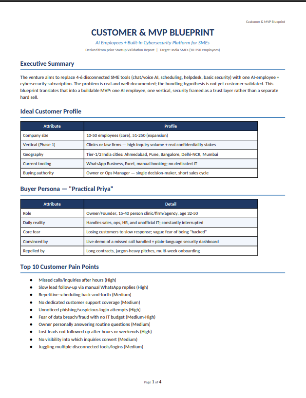
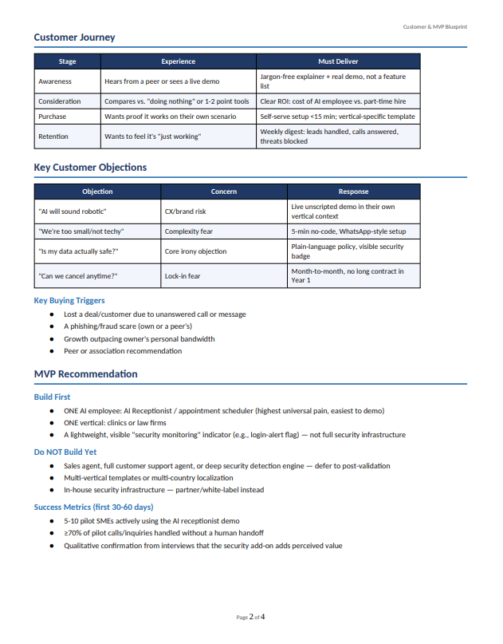
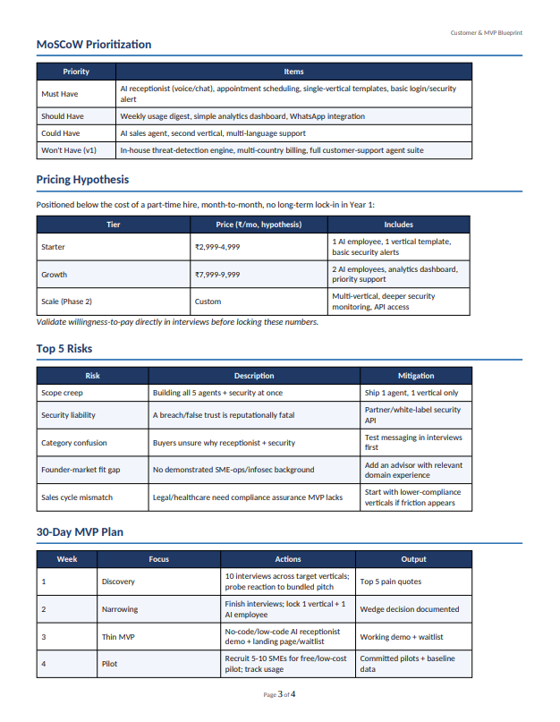
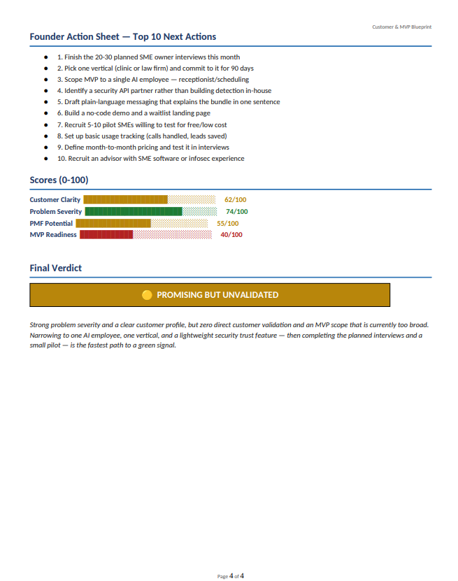

# Day 23 – Customer & MVP Blueprint

## Overview

On Day 23 of the 60 Day Claude Challenge, I used Claude AI as a **Startup Product Manager and Customer Research Expert** to transform my startup validation into a practical Customer & MVP Blueprint.

The goal was to identify the ideal customer, understand real customer pain points, prioritize MVP features, and create a focused execution roadmap before starting product development.

---

# Startup Idea

**AI Workforce OS**

An AI-powered SaaS platform that provides AI Employees with built-in Cybersecurity for Small & Medium Businesses (SMEs).

### AI Employees

- AI Receptionist
- AI Sales Agent
- AI Customer Support
- AI Appointment Scheduler

### Security Features

- Phishing Detection
- Fraud Detection
- Suspicious Login Alerts
- Data Leak Monitoring

---

# Executive Summary

The analysis validated that SMEs struggle with limited staff, slow customer response, and increasing cybersecurity threats. Instead of building every feature at once, the report recommends launching a focused MVP with one AI employee and lightweight security features.

---

# Ideal Customer Profile (ICP)

- Small & Medium Businesses (10–50 employees)
- Clinics
- Law Firms
- Accounting Firms
- Retail Businesses
- Real Estate Agencies

Decision Makers:

- Business Owners
- Founders
- Operations Managers

---

# Buyer Persona

A busy SME owner who manages operations, sales, customer communication, and administration while looking for affordable automation without technical complexity.

---

# Top Customer Pain Points

- Missed customer inquiries
- Slow response time
- Staff shortages
- Manual appointment scheduling
- Limited IT resources
- Growing cybersecurity risks
- Expensive software subscriptions
- Inefficient lead management
- Lack of automation
- Difficulty scaling operations

---

# MVP Recommendation

### Build First

- AI Receptionist
- AI Sales Assistant
- Basic Security Monitoring Dashboard

### Do NOT Build Initially

- Full AI Workforce
- Advanced Cybersecurity Infrastructure
- Enterprise Compliance Features

---

# Key Insights

- Start with one AI employee instead of a complete AI workforce.
- Customer validation should come before product expansion.
- Focus on solving one high-value problem exceptionally well.
- Build a simple MVP and gather customer feedback before scaling.

---

# Skills Practiced

- Customer Discovery
- Buyer Persona Design
- Customer Journey Mapping
- MVP Planning
- Product Strategy
- Feature Prioritization (MoSCoW)
- Startup Planning

---

# Repository Contents

- Customer_MVP_Blueprint.pdf
- customer_persona.png
- customer_journey.png
- mvp_recommendation.png
- founder_action_sheet.png

---

# Screenshots

## Customer Persona

---

## Customer Journey

---

## MVP Recommendation

---

## Founder Action Sheet

---

# Key Learnings

- Great startups begin with customer problems, not product ideas.
- A focused MVP reduces development risk.
- Customer interviews are essential before scaling.
- Prioritization helps avoid unnecessary features.
- Continuous validation increases Product-Market Fit.

---

# Conclusion

This exercise reinforced the importance of customer-first product development. By identifying the right audience, validating assumptions, and building only the essential MVP features, founders can reduce risk, accelerate learning, and improve the chances of achieving Product-Market Fit.
