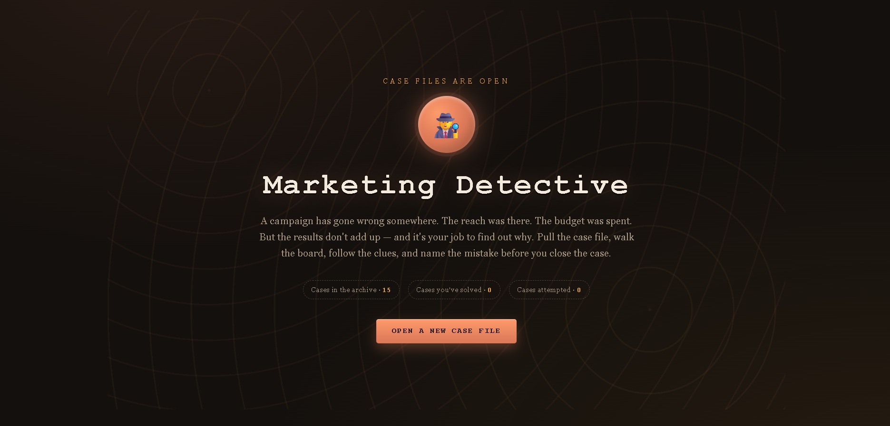
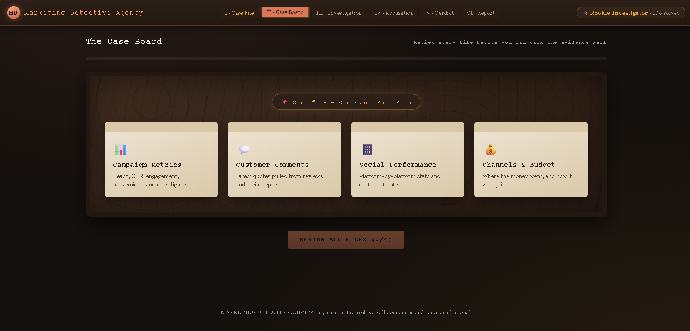
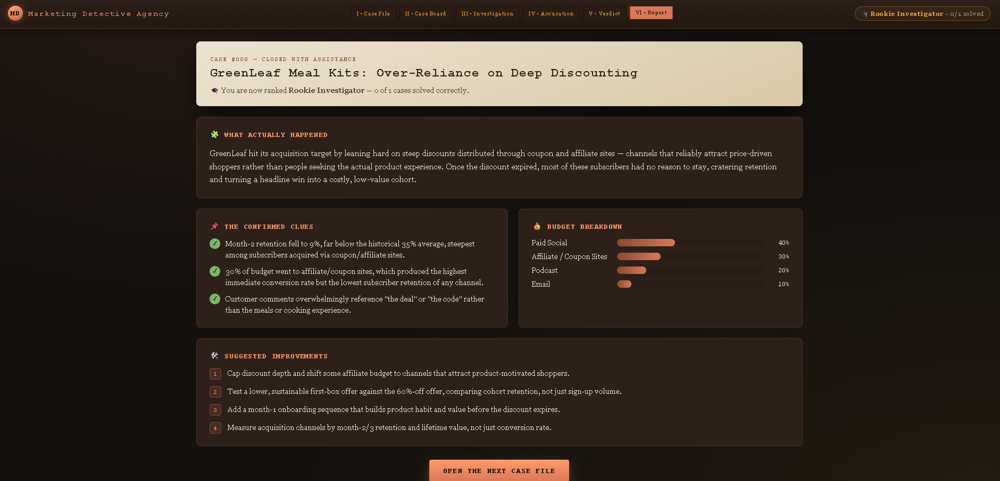

# Day 34 - Marketing Detective

## About

For Day 34, I created a Marketing Detective web application. The app presents different fictional marketing cases where the user investigates campaign data, finds the main marketing mistake, and then checks the correct explanation.

## Features

- Theme selection
- Random marketing cases
- Investigation board
- Drag and drop evidence
- Case solving
- Learning report
- Responsive design

## Screenshots

### Home

### Investigation Board

### Case Closed

### Learning Report

## What I Learned

- How different marketing metrics help analyze campaign performance.
- The importance of choosing the right audience and marketing channel.
- How customer feedback can reveal campaign issues.
- Building an interactive single-page HTML application.

## Files

- Marketing Detective.html
- day34.md
- home.png
- investigation-board.png
- case-closed.png
- learning-report.png
