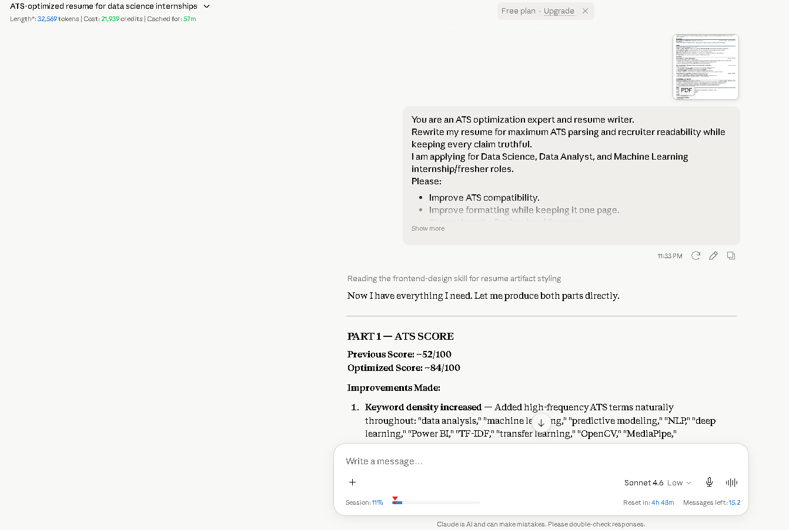
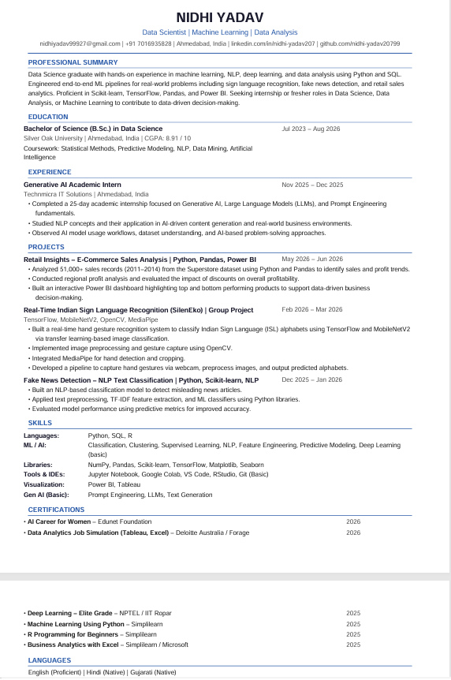

# Day 6 – ATS Resume Optimization using Claude

## Objective

The objective of today's task was to optimize my resume for better Applicant Tracking System (ATS) compatibility and improve recruiter readability using Claude AI.

---

## Original Resume

**Resume File**

* [Original Resume](original_resume.pdf)

---

## ATS Analysis

**Estimated ATS Score**

* Previous Score: **52/100**
* Optimized Score: **84/100**

### Improvements Made

* Improved ATS keyword optimization.
* Rewrote the professional summary using relevant industry keywords.
* Used stronger action verbs throughout the resume.
* Organized the skills section into clear categories.
* Removed redundant wording.
* Standardized section headings for ATS compatibility.
* Improved contact information placement.
* Consolidated certifications for better readability.

**Screenshot**

---

## Optimized Resume

**Resume File**

- [Optimized Resume](optimized_resume.pdf)
**Screenshot**

---

## Key Learnings

* ATS-friendly resumes should use simple formatting.
* Strong keywords improve resume visibility.
* Action verbs make project descriptions more impactful.
* Clear section headings help both ATS systems and recruiters.
* Resume optimization should improve readability without changing factual information.

---

## Tools Used

* Claude AI
* GitHub
* Microsoft Word
* PDF

---

## Outcome

Successfully optimized my resume for ATS compatibility while maintaining accurate information and improving recruiter readability.

